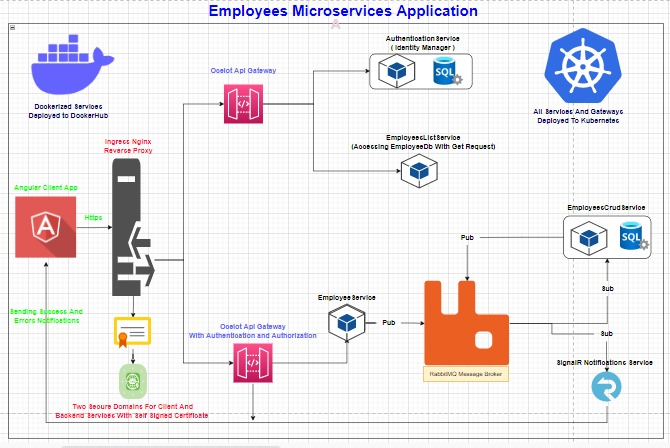

# EmployeesMicroserviesSystem
This is Microservices Project built with .NETCore(6.0), Angular(13.0), Ocelot Api Gateways, RabbitMQ, SQL Server Databases,docker and Kubernetes Deployment
# Project Archtiture


# Description
The Project is Microservices Application built with Devolopment and Production Environment Consists Of :```
1- Angular(13.0) Client Application ``` __
2- .NETCore(6.0) For Backend Services talking to Each With httpclient Synchronous and RabbitMQ for Asynchronous Messaging ```
3- 2 Ocelot Api Gate in front of ingress nginx controller to route to the backend services one of them use authentication and authorization and the other not ```
4- service for identity manager to manage users and roles for the applications and send it to the gateways to authenticate users with its sql server database ```
5- SignalR real time communication service connecting to the angular application throw the Ocelot Api Gateway To send Success and Error Updates and Messages ```
6- DockerFiles for each service and .yaml deployment files for each service and database and pipelines ```
7- Self Signed Certificate for the local secure https connection for the deployed application with 2 diffrent domains talking to each other one for the client and one for the rest backend services ```
8- the project is ready to run in production mode with the right kubernetes platform or in Devolopment Mode with local Dev runners with internal Commands:```
dotnet run - for the .Net services ```
ng serve - for the angular application```
